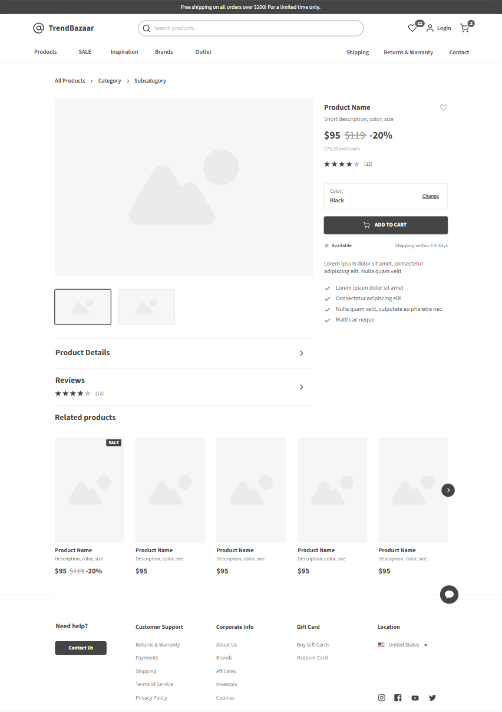
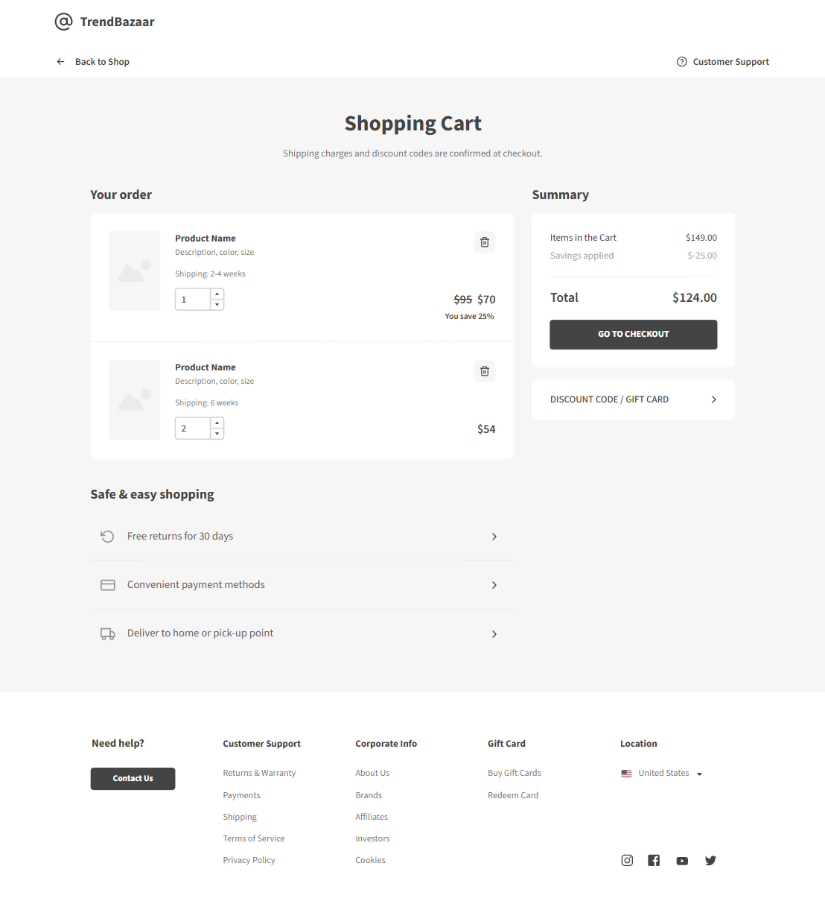

# 📋 Software Requirements Specification (SRS) — TrendBazaar

## 📑 Содержание
[1. Введение](#1-введение)  
&emsp;[1.1 Назначение](#11-назнaчение)  
&emsp;[1.2 Бизнес-требования](#12-бизнес-требования)  
&emsp;[1.3 Аналоги](#13-аналогии)  
[2. Требования пользователя](#2-требования-пользователя)  
&emsp;[2.1 Программные интерфейсы](#21-программные-интерфейсы)  
&emsp;[2.2 Интерфейс пользователя](#22-интерфейс-пользователя)  
&emsp;[2.3 Характеристики пользователей](#23-характеристики-пользователей)  
&emsp;[2.4 Предположения и зависимости](#24-предположения-и-зависимости)  
[3. Системные требования](#3-системные-требования)  
&emsp;[3.1 Функциональные требования](#31-функциональные-требования)  
&emsp;[3.2 Нефункциональные требования](#32-нефункциональные-требования)  
[4. Эскизы интерфейса](#4-эскизы-интерфейса)  
[5. Технологический стек](#5-технологический-стек)  
[6. Безопасность и производительность](#6-безопасность-и-производительность)  
[7. Тестирование](#7-тестирование)  
[8. Развёртывание](#8-развёртывание)  

---

## 1. Введение  

### 1.1 Назначение  
Данный документ описывает функциональные и нефункциональные требования к веб-приложению **TrendBazaar**, предназначенному для онлайн-продажи товаров. Система предоставляет удобный интерфейс для пользователей, позволяющий просматривать товары, добавлять их в корзину и оформлять заказы, а администраторам — управлять категориями и продуктами, контролировать заказы и остатки.

### 1.2 Бизнес-требования  
Современные интернет-магазины требуют удобного инструмента для централизованного управления товарами, категориями и заказами. **TrendBazaar** упрощает процессы покупки и управления, повышает скорость обработки заказов и минимизирует ошибки, возникающие при ручном учёте. Система должна быть интуитивно понятной, гибкой и готовой к расширению функционала с ростом бизнеса.

### 1.3 Аналоги  
На рынке представлены решения, такие как Shopify, WooCommerce и Magento. Они обладают широким функционалом, но часто требуют платных подписок, сложной настройки и серверного окружения. **TrendBazaar** предлагает простое развёртывание на локальном или облачном сервере с полной кастомизацией и контролем данных.

---

## 2. Требования пользователя  

### 2.1 Программные интерфейсы  
Система предоставляет REST API с передачей данных в формате JSON, что позволяет интегрировать внешние приложения и сервисы. Документация API доступна через Swagger UI. Также предусмотрен импорт и экспорт данных в стандартных форматах.

### 2.2 Интерфейс пользователя  
Веб-приложение обеспечивает удобный доступ к товарам, категориям и заказам. Пользователи могут добавлять товары в корзину, оформлять заказы и отслеживать их статус. Администраторы получают панель управления для CRUD-операций с категориями, продуктами и заказами.

### 2.3 Характеристики пользователей  
- **Покупатели:** обычные пользователи интернета, умеющие работать с браузером, ищущие удобный способ покупки.  
- **Администраторы:** менеджеры магазинов, отвечающие за наполнение каталога, обработку заказов и отчётность.  

### 2.4 Предположения и зависимости  
- Необходим доступ к интернету для работы веб-клиента и REST API.  
- Данные хранятся в PostgreSQL, обеспечивающей целостность информации.  
- Серверная часть развёрнута на платформе, поддерживающей Java + Spring Boot.  

---

## 3. Системные требования  

### 3.1 Функциональные требования  
- CRUD для категорий товаров: создание, редактирование, удаление и просмотр.  
- CRUD для продуктов с указанием названия, категории, цены, количества и описания.  
- Создание заказов пользователями с указанием названия продукта и количества.  
- Автоматическое обновление остатка товара при оформлении заказа.  
- Просмотр и изменение статуса заказа: новый, в обработке, отправлен, отменён.  
- Валидация данных на клиенте и сервере, понятные сообщения об ошибках.  
- in-memory кэш часто запрашиваемых данных для ускорения работы.  

### 3.2 Нефункциональные требования  
- Масштабируемость и поддержка горизонтального расширения.  
- Работа в Docker-контейнерах для упрощённого развёртывания.  
- Корректная обработка ошибок и ведение журналов.  
- Совместимость с современными браузерами (Chrome, Firefox, Edge).  

---

## 4. Эскизы интерфейса  
Главное меню веб-приложения включает:  

### Авторизация / Регистрация

### Сброс пароля через почту

### Главная страница

### Категории товаров

### Детали продукта

### Корзина и оформление заказа

---

## 5. Технологический стек  

| Компонент       | Технология               |
|-----------------|-------------------------|
| Backend         | Java + Spring Boot       |
| Frontend        | TypeScript + React       |
| База данных     | PostgreSQL               |
| ORM             | Hibernate/JPA            |
| Документация API| Swagger UI               |
| Тестирование    | JUnit 5, Mockito         |
| Контейнеризация | Docker, Docker Compose   |

---

## 6. Безопасность и производительность  
- Проверка и валидация всех входных данных.  
- Глобальный обработчик ошибок, скрывающий внутренние детали приложения.  
- Логирование действий пользователей и администраторов.  
- Кэширование часто запрашиваемых данных для повышения скорости отклика.  

---

## 7. Тестирование  
- Юнит-тесты всех сервисов и бизнес-логики.  
- Интеграционные тесты REST API.  
- Проверка корректности импорта и экспорта данных.  
- Тестирование интерфейса и функциональности корзины и заказов.  

---

## 8. Развёртывание  
- Поддержка Docker и Docker Compose для быстрого развёртывания.  
- Профили dev и prod для разных сред.  
- Возможность развёртывания на локальном сервере, VPS или в облаке.  
- Поддержка CI/CD пайплайнов для автоматизации сборки и деплоя.
