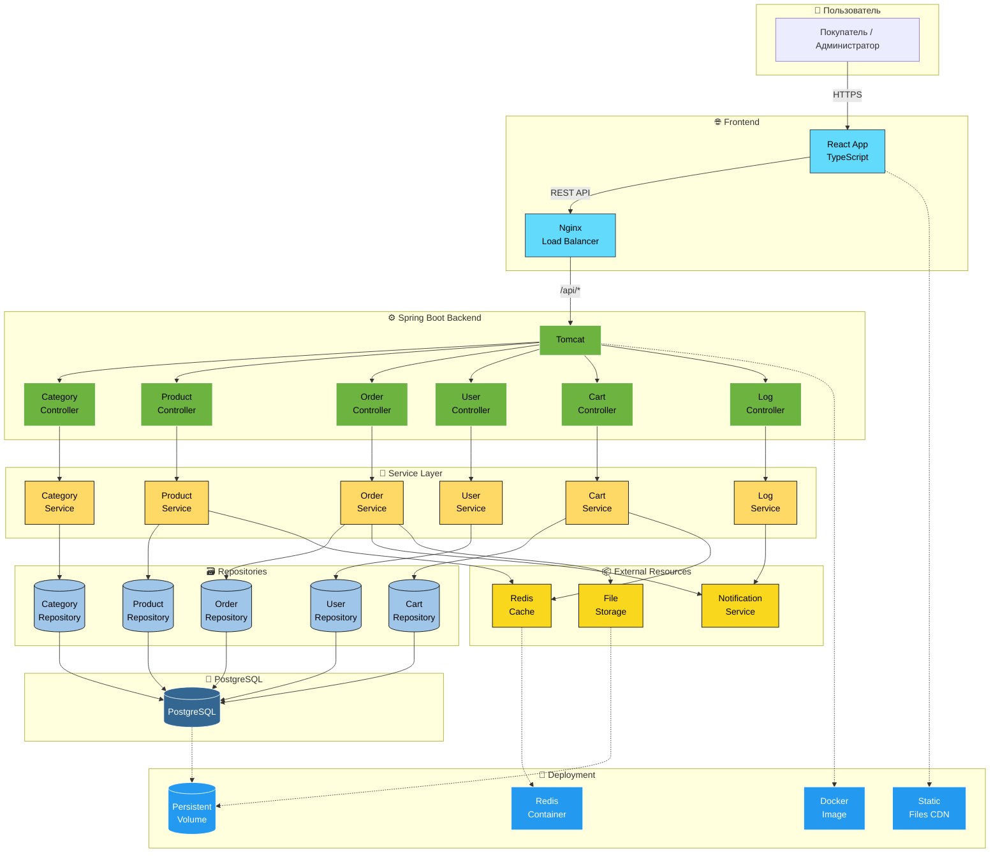

# 🏛️ Архитектура проекта — TrendBazaar

## 📐 Общая структура
Система построена по классической многослойной архитектуре:

- **Фронтенд:** веб-клиент на React + TypeScript, обеспечивает взаимодействие пользователя с приложением через браузер.  
- **Бэкенд:** Java Spring Boot с REST API, обрабатывает запросы от фронтенда, реализует бизнес-логику и взаимодействие с базой данных.  
- **Слой сервисов:** содержит бизнес-логику приложения — обработку заказов, управление продуктами, корзиной и пользователями.  
- **Репозитории:** взаимодействуют с базой данных PostgreSQL через JPA/Hibernate для сохранения и получения данных.  
- **Внешние ресурсы:** кэш (Redis), сервис уведомлений, файловое хранилище для хранения изображений товаров.  
- **Развёртывание:** Docker-контейнеры для фронтенда и бэкенда, Nginx в качестве балансировщика и CDN для статики.

## 🖼️ Схема архитектуры

